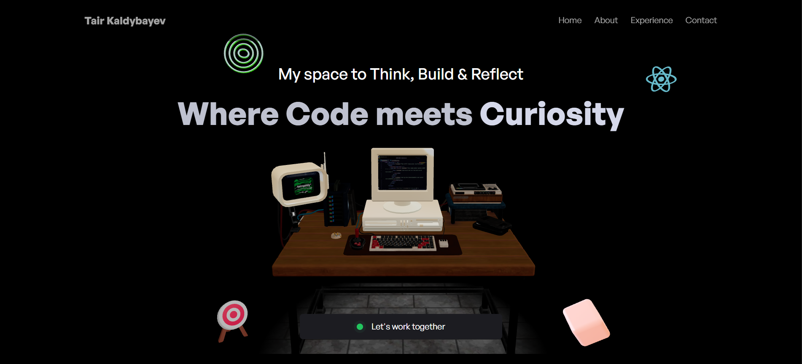

# 🎮 Three.js 3D Portfolio - Tair Kaldybayev


---

## 👋 Hey There, Fellow Developer!

So you've stumbled upon my 3D portfolio project. Whether you're here because you're:
- 🎯 **Recruiting** and checking if I can actually code (spoiler: I'm obsessed with it)
- 🚀 **Learning** Three.js and looking for inspiration
- 🤔 **Curious** about 3D web development
- 😅 **Lost** on GitHub at 3 AM (we've all been there)

**Welcome!** Grab a coffee ☕ and let me tell you a story.

---

## 🌟 The Story Behind This Project

You know that moment when you see a website with 3D graphics and think, "Holy sh*t, how did they do that?"

That was me a few months ago. I was scrolling through portfolios, feeling mine was... well, boring. Just another grid of projects with hover effects. Then I discovered Three.js and React Three Fiber, and I knew I had to dive in.

But here's the thing - **I didn't just build this in silence.**

I started my **"Dev Lock-In Streaming Series"** on [YouTube](https://youtube.com/@tairqaldy) to document the entire journey. Every bug, every "why isn't this cube rotating?!", every victory when something finally works. It's raw, it's real, and it's a testament to the fact that great code doesn't come from geniuses - it comes from people willing to debug for hours.

This portfolio is the result of **27 cups of coffee** ☕, countless hours of experimentation, and an unhealthy obsession with making things look cooler than they need to be.

### 🎬 Watch Me Build It
> 📺 Want to see the behind-the-scenes? Check out the [Dev Lock-In Streaming Series](https://youtube.com/@tairqaldy) where I document building this and future projects. No cuts, no scripts - just real development.

---

## 💭 Why I Built This (The Real Reason)

**The official reason:** To showcase my skills in React and 3D web development.

**The actual reason:** Because I got tired of seeing the same portfolio templates everywhere. I wanted something that would make people go "Whoa, this is different." Something that represents who I am - someone who's obsessed with coding and isn't afraid to try crazy stuff.

Plus, rotating cubes are just objectively cooler than flat images. Fight me. 🥊

### What I Learned
- 🎓 Three.js is powerful but has a learning curve steeper than my coffee consumption
- 🐛 3D debugging is... an experience (why is my character floating 10 units above the ground?)
- ⚡ Performance optimization matters when you're rendering entire 3D scenes
- 🎨 Even developers need to think about aesthetics
- 📦 Sometimes the best way to learn is to just build something ambitious and figure it out

---

## ✨ What Makes This Special?

> 💡 **TL;DR:** It's not just a portfolio. It's a 3D experience that actually works on mobile (yes, I tested it extensively).

### 🎨 The Cool Stuff
- **🖥️ 3D "Hacker Room"** - Because every developer fantasizes about having that perfect setup
- **👋 Animated Character** - My digital twin that waves, claps, and celebrates your achievements (mostly mine)
- **🌍 Interactive Globe** - Click it. Seriously, it's satisfying.
- **🎮 Floating Objects** - React logo, Rubik's cube, and more spinning things because... why not?
- **💡 Custom 3D Models** - Built from scratch (yes, I modeled a lightbulb for no reason other than it looks cool)

<details>
<summary><b>🔍 Show Me the Tech Stack (for the nerds)</b></summary>

### The Arsenal
```
Frontend Magic:
├── React 19 (with hooks that actually make sense now)
├── Vite (because life's too short for slow builds)
└── Tailwind CSS (utility classes > writing CSS from scratch)

3D Wizardry:
├── Three.js (the OG 3D library)
├── React Three Fiber (Three.js but React-y)
├── Drei (helpers that saved me hours)
└── GSAP (smooth animations that make designers happy)

The Extras:
├── EmailJS (contact forms without a backend!)
├── React Globe GL (that spinny earth thing)
└── 27 cups of coffee ☕
```
</details>

### 📱 Yes, It Works on Mobile
I spent **way too much time** making sure this works on phones. If you're reading this on mobile, try it. The 3D scenes actually adapt. Revolutionary? No. Did it require debugging at 2 AM? Absolutely.

### 🎯 The Experience
Navigate through:
1. **Hero** - First impressions matter (spinning objects help)
2. **About** - Who I am (obsessed with coding, obviously)
3. **Experience** - My journey with an animated character
4. **Projects** - The stuff I've built (with 3D previews)
5. **Contact** - Reach out (the form actually works!)

---

## 🎬 See It In Action

> 📹 **Pro tip:** Check out my [Dev Lock-In streams](https://youtube.com/@tairqaldy) to see how this was built, including all the mistakes I made along the way.

<div align="center">

### 🖼️ Visual Tour

| 3D Scene | Responsive Design |
|----------|-------------------|
|  |  |

*Screenshots from the actual portfolio - what you see is what you get*

</div>

## 🚀 Want to Build Your Own?

> 🎯 **Dear Future Me (or You):** This section is for when you want to fork this and make it yours. I tried to make it as painless as possible.

### What You'll Need
- **Node.js 18+** - [Get it here](https://nodejs.org/) *(trust me, the newer the better)*
- **Git** - [Download](https://git-scm.com/) *(you probably already have this)*
- **A modern browser** - Chrome/Firefox/Safari/Edge *(no IE11, please)*
- **Patience** - Some 3D assets take time to load the first time
- **Coffee** - Optional but highly recommended ☕

### Let's Get Started

```bash
# 1. Grab the code
git clone https://github.com/tairqaldy/three.js-3d-portfolio-website.git
cd three.js-3d-portfolio-website

# 2. Install the magic
npm install
# ☕ Grab a coffee. This might take a minute.

# 3. Fire it up!
npm run dev
# 🎉 Opens at http://localhost:5173
```

### The Commands You'll Actually Use

```bash
# Development (hot reload, the works)
npm run dev

# Build for production (minified and optimized)
npm run build

# Preview your production build locally
npm run preview

# Lint your code (if you care about clean code)
npm run lint
```

<details>
<summary><b>🐛 Something broke? Troubleshooting tips</b></summary>

**Port 5173 already in use?**
- Kill the process or Vite will auto-increment the port

**3D models not loading?**
- Check your `public/models/` directory
- Make sure files are `.glb` format
- Clear browser cache (classic solution)

**Performance issues?**
- Check if hardware acceleration is enabled in your browser
- Lower the quality settings in the code (I left comments)
- Sacrifice a rubber duck to the debugging gods 🦆

**EmailJS not working?**
- You need to add your own API keys (more on that below)

</details>

---

## 🎨 Making It Yours

> 💬 **Real talk:** Don't just clone this and change the name. Make it YOUR portfolio. Add your personality, your projects, your vibe. Here's how:

### 🔧 Step 1: The Essentials

<details>
<summary><b>📝 Personal Info (src/constants/index.js)</b></summary>

This is your data hub. Everything from projects to work experience lives here.

```javascript
// Find these sections and make them yours:
export const workExperiences = [
  {
    name: "Your Company",
    position: "Your Title",
    duration: "2023 - Present",
    // Don't just copy - tell YOUR story
  }
]

export const myProjects = [
  // Add projects YOU'RE proud of
  // Even the ones that broke in production
]
```

**Pro tip:** Be honest about what you built. Recruiters can tell.

</details>

<details>
<summary><b>📧 Contact Form Setup (src/sections/Contact.jsx)</b></summary>

The contact form uses [EmailJS](https://www.emailjs.com/) (free tier is generous).

1. Sign up at EmailJS
2. Create an email service
3. Create a template
4. Grab your keys

```javascript
// Line ~29-38 in Contact.jsx
emailjs.send(
  'YOUR_SERVICE_ID',      // From EmailJS dashboard
  'YOUR_TEMPLATE_ID',     // Your template ID
  templateParams,
  'YOUR_PUBLIC_KEY'       // Your public key
)
```

**Why EmailJS?** Because I didn't want to set up a backend for one form. Work smarter, not harder.

</details>

<details>
<summary><b>🎭 3D Models (public/models/)</b></summary>

Want to customize the 3D elements?

**Replace these:**
- `developer.glb` - Your character (or find one on Sketchfab)
- `hacker-room.glb` - Your ideal workspace
- Any other `.glb` models

**Where to find models:**
- [Sketchfab](https://sketchfab.com/) - Free & paid models
- [Poly Haven](https://polyhaven.com/) - Free, quality assets
- Blender - Make your own (if you're brave)

**Keep files under 5MB** or your loading times will suffer.

</details>

<details>
<summary><b>🎨 Colors & Styling (src/index.css)</b></summary>

Don't like my dark theme? Change it!

```css
/* Find the CSS variables and go wild */
:root {
  --color-primary: #yourcolor;
  --color-background: #yourbackground;
  /* etc... */
}
```

Just promise me you won't use Comic Sans. Please.

</details>

### 🚀 Step 2: The Content

**Images** → `public/assets/`
- Replace my logos with yours
- Update project screenshots
- Add your branding

**Text** → Sections in `src/sections/`
- `About.jsx` - Tell YOUR story
- `Hero.jsx` - Your introduction
- `Projects.jsx` - Your work

**Remember:** This is YOUR portfolio. Your personality should shine through, not mine.

---

## 📁 How This Thing Is Organized

> 🗺️ **Navigation tip:** Everything is pretty intuitive. If you're looking for something specific, chances are it's where you'd expect it to be.

<details>
<summary><b>🔍 Click to see the full structure</b></summary>

```
src/
├── components/              # The 3D magic happens here ✨
│   ├── Button.jsx          # Not your average button
│   ├── CanvasLoader.jsx    # "Loading..." but make it 3D
│   ├── Cube.jsx            # A cube. It spins. It's glorious.
│   ├── Developer.jsx       # My digital twin
│   ├── HackerRoom.jsx      # The dream workspace
│   ├── HeroCamera.jsx      # Makes the camera do cool things
│   ├── Lightbulb.jsx       # Why? Because I could.
│   ├── ReactLogo.jsx       # React logo in 3D (React-ception)
│   ├── RubicsCube.jsx      # Unsolvable, like real life
│   ├── Target.jsx          # GSAP animation showcase
│   └── Tree.jsx            # A tree. In 3D. On the web.
│
├── sections/               # The actual content
│   ├── About.jsx          # Who I am & what I do
│   ├── Contact.jsx        # Email me (please be nice)
│   ├── Essays.jsx         # My thoughts in blog form
│   ├── Experience.jsx     # My journey so far
│   ├── Footer.jsx         # The bottom bit
│   ├── Hero.jsx           # The first thing you see
│   ├── Navbar.jsx         # Navigation (always visible)
│   └── Projects.jsx       # The stuff I've built
│
├── constants/
│   └── index.js           # 📊 ALL the data lives here
│                          # Work, projects, skills - everything
│
├── App.jsx                # The mothership
├── index.css              # Global styles & CSS variables
└── main.jsx               # Where React starts

public/
├── models/                # 3D files (large files live here)
│   ├── animations/        # .fbx animation files
│   ├── human/            # Character models
│   └── *.glb             # 3D models (GLB format)
│
├── assets/               # Images, logos, icons
│   └── *.png *.svg       # All the 2D stuff
│
└── textures/             # Textures for 3D models
    ├── desk/             # Desk textures
    └── project/          # Project videos & textures
```

**Quick Guide:**
- Need to change text/data? → `src/constants/index.js`
- Want to modify a section? → `src/sections/`
- Playing with 3D stuff? → `src/components/`
- Adding assets? → `public/assets/` or `public/models/`

</details>

---

## 🎭 About Those 3D Assets

> 🎨 **Fun fact:** I spent way too much time getting the lighting just right on that models. Was it worth it? Absolutely.

<details>
<summary><b>📦 What's included</b></summary>

### Character Animations
- `idle.fbx` - Chillin' (default state)
- `salute.fbx` - Professional greeting
- `clapping.fbx` - When something works first try
- `victory.fbx` - Successful deployment vibes

### 3D Models
- `hacker-room.glb` - The dream setup
- `developer.glb` - That's me (but 3D)
- `react.glb` - React logo because React
- `cube.glb` - The mandatory spinning cube

### Built from Scratch
- **💡 Lightbulb** - Procedural 3D with glow effects 
- **🧩 Rubik's Cube** - 3x3x3 with rotation animations
- **🌲 Tree** - Multi-layer pine with wind animation

**File size tips:**
- GLB format is your friend
- Keep individual models under 5MB
- Compress textures (but not too much)
- Test on mobile! (trust me on this)

</details>

---

## ⚡ Performance Stuff

> 🏎️ **Philosophy:** Fast is better than pretty. But why not both?

### What I Did to Make It Fast
- **Lazy loading** - Components load when needed, not all at once
- **Optimized models** - Compressed without losing quality
- **Texture optimization** - Smaller files, same visual impact
- **Suspense boundaries** - Graceful loading states
- **Memoization** - React doesn't re-render what hasn't changed

### What You Can Do
- Enable hardware acceleration in your browser
- Close other tabs (Chrome users, you know what you did)
- If you're on a potato computer, lower the quality settings in the code

**Real talk:** This runs smoothly on most modern devices. If it doesn't, check your browser settings or your RAM situation.

---

## 🤝 Want to Contribute?

> 💭 **Honestly?** This is primarily my portfolio, but if you spot a bug or have a cool idea, I'm all ears!

Found a bug? Have a suggestion? Here's how:

1. **Fork it** - Make it your own
2. **Branch it** - `git checkout -b feature/your-cool-idea`
3. **Code it** - Write clean, commented code
4. **Test it** - Make sure it works
5. **Push it** - `git push origin feature/your-cool-idea`
6. **PR it** - Open a Pull Request with a good description

**Ideas welcome for:**
- 🐛 Bug fixes (especially 3D-related ones)
- ⚡ Performance improvements
- 🎨 Visual enhancements
- 📱 Mobile optimization

Just... please don't suggest adding auth. 😅

---

## 👨‍💻 About Me

**Tair Kaldybayev** - Developer obsessed with coding

I'm a developer who believes in learning by building. This portfolio is just one project in my journey. You can find more of my work and journey here:

🌐 **Where to find me:**
- 📺 [YouTube](https://youtube.com/@tairqaldy) - Dev Lock-In Streaming Series
- 💼 [LinkedIn](https://www.linkedin.com/in/tair-kaldybayev-922198312/) - Professional stuff
- 📧 [Email](mailto:taircaldy.yt@gmail.com) - Reach out anytime
- 🌐 [Portfolio](https://tairkaldybayev.vercel.app/) - Check production website

> ☕ **Current status:** Probably coding something, drinking coffee, or both.

---

## 🙏 Standing on the Shoulders of Giants

This project wouldn't exist without these amazing tools and resources:

### The Tech Stack
- [**Three.js**](https://threejs.org/) - Made 3D on the web actually possible
- [**React Three Fiber**](https://docs.pmnd.rs/react-three-fiber) - Three.js + React = ❤️
- [**Drei**](https://github.com/pmndrs/drei) - Saved me countless hours
- [**GSAP**](https://greensock.com/) - Smooth animations that just work
- [**Tailwind CSS**](https://tailwindcss.com/) - Utility-first CSS (no more naming classes!)
- [**Vite**](https://vitejs.dev/) - Fast builds, happy developer

### The Learning Journey
- [**JavaScript Mastery**](https://www.youtube.com/watch?v=kt0FrkQgw8w) - The tutorial that started it all
  - 📁 [Free Video Kit](https://jsm.dev/pfolio24-kit) - Code, design, assets, guide
  
> 💡 **Real recommendation:** If you're learning Three.js, I can't recommend the JavaScript Mastery tutorial enough. Don't just copy-paste - actually write the code, break it, fix it, understand it. That's how I learned, and it worked.

### Special Thanks To
- **Coffee** ☕ - The real MVP (27 cups and counting)
- **Stack Overflow** - For answering questions I didn't know I had
- **My rubber duck** 🦆 - Best debugging partner
- **You** - For reading this far. Seriously, thanks!

---

## 📄 License

MIT License - which means you can:
- ✅ Use it commercially
- ✅ Modify it
- ✅ Distribute it
- ✅ Use it privately

Just:
- 📝 Keep the license notice
- 💼 Don't blame me if something breaks

See the [LICENSE](LICENSE) file for the boring legal stuff.

---

## 📊 Project Stats


---

<div align="center">

## 🌟 Final Words

If you made it this far, you're either:
1. Really interested in this project (thank you! ❤️)
2. Procrastinating (we've all been there)
3. A very thorough recruiter (hi! I'm available!)

Whatever brought you here, I appreciate you taking the time to check out my work.

### ⭐ Star this repo if it helped you!

### 💬 Questions? Suggestions? Just want to chat about 3D web dev?

**Hit me up!** I'm always happy to talk code, share knowledge, or discuss why that one cube won't stop spinning.

---

*Built with ❤️, React, Three.js, and way too much coffee*

*Last updated: October 2025*

**P.S.** - If you fork this and build something cool, let me know! I'd love to see what you create. 🚀

</div>